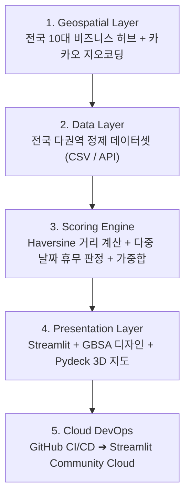

# 📊 [Presentation Deck] 대한민국 맞춤형 회식장소 추천 서비스 (총 7장)

> **발표 시간:** 약 5~7분  
> **대상:** 기술 평가위원, 팀 리더, 비즈니스 의사결정권자, 동료 개발자  
> **핵심 주제:** 데이터 기반 다차원 스코어링 및 실시간 지리공간(GIS) 기술을 활용한 전국 오피스 상권 회식 추천 솔루션

---

## 📑 Slide 1. 표지 및 프로젝트 개요 (Title & Overview)

### [슬라이드 레이아웃]
* **메인 타이틀:** 🏢 **대한민국 맞춤형 회식장소 추천 서비스**
* **서브 타이틀:** *"판교에서 전국으로 — 직장인의 탐색 비용을 90% 절감하는 데이터 기반 의사결정 플랫폼"*
* **프로젝트 메타:** 발표자: jay-jay-jay | 배포 플랫폼: Streamlit Community Cloud & GitHub

```
┌─────────────────────────────────────────────────────────────┐
│  🏢 대한민국 맞춤형 회식장소 추천 플랫폼 (Nationwide Recommender)│
│                                                             │
│  • 실시간 전국 10대 오피스 허브 & 지오코딩 탐색             │
│  • 4대 조건(예산·룸·거리·평점) 다차원 가중합 100점 스코어링 │
│  • 복수 후보 일정 교차 휴무일 자동 판정                      │
│  • Pydeck 지리공간(GIS) 인터랙티브 시각화                   │
└─────────────────────────────────────────────────────────────┘
```

### 🎙️ 발표자 스크립트 (Script)
> "안녕하십니까, **'대한민국 맞춤형 회식장소 추천 서비스'** 발표를 맡은 jay-jay-jay입니다.  
> 직장인들에게 회식 장소를 잡는 일은 예산, 룸 유무, 팀원들의 이동 거리, 휴무일 등 수많은 변수를 고려해야 하는 큰 스트레스 중 하나입니다.  
> 본 프로젝트는 판교테크노밸리에서 출발하여 강남, 여의도, 을지로, 부산, 대전 등 **대한민국 전역의 비즈니스 상권을 아우르는 정량적 데이터 기반 회식 추천 시스템**입니다. 지금부터 그 핵심 기술과 구현 결과를 소개해 드리겠습니다."

---

## 📑 Slide 2. 문제 제기 및 개발 배경 (Why? Problem Statement)

### [슬라이드 레이아웃]
* **기존 포털/블로그 검색의 4대 한계점 (Pain Points):**

| 기존 방식의 한계 | 본 서비스의 해결책 (Solution) |
|---|---|
| **1. 탐색 피로도 & 시간 낭비** | 필터 설정 한 번으로 **적합도 1위부터 N위까지 1초 만에 랭킹** |
| **2. 주관적 광고성 리뷰의 함정** | 1인 예산, 평점, 리뷰 수를 정규화한 **객관적 100점 지표** |
| **3. 거리 및 이동 동선의 오차** | 선택한 지하철역/사옥 기준 **하버사인 실시간 거리(m) 계산** |
| **4. 일정 조율 및 당일 휴무 실패** | 여러 회식 후보 날짜를 한 번에 검증하는 **다중 일정 교차 판정** |

### 🎙️ 발표자 스크립트 (Script)
> "기존 포털 사이트나 블로그에서 회식 장소를 찾을 때 가장 큰 문제는 '정보의 불일치'였습니다.  
> 평점이 높아 찾아갔더니 단체 룸이 없거나, 1인 예산을 초과하거나, 심지어 회식 당일이 정기 휴무일이라 낭패를 보는 경우가 빈번했습니다.  
> 저희는 이러한 감(感)에 의존한 검색을 탈피하고, **실제 직장인들이 요구하는 필수 제약조건을 수학적으로 정량화하여 자동 매칭해 주는 시스템**을 설계했습니다."

---

## 📑 Slide 3. 시스템 아키텍처 및 파이프라인 (System Architecture)

### [슬라이드 레이아웃]
* **5계층(End-to-End) 아키텍처 다이어그램:**



### 🎙️ 발표자 스크립트 (Script)
> "전체 시스템은 5개의 계층으로 깔끔하게 분리되어 있습니다.  
> 1단계에서 사용자가 지정한 위치의 좌표를 추출하고, 2단계에서 전국 데이터셋을 공급합니다.  
> 3단계 스코어링 엔진에서는 하버사인 구면 삼각법으로 기준 위치와의 실제 거리를 계산하고, 다중 후보 일정의 영업 여부를 교차 검증합니다.  
> 4단계에서는 GBSA 디자인 시스템과 Pydeck 인터랙티브 지도로 시각화하며, 5단계 GitHub 연동을 통해 24시간 무중단 클라우드 배포를 실현했습니다."

---

## 📑 Slide 4. 핵심 알고리즘: 다차원 가중합 & GIS 엔진 (Core Engine)

### [슬라이드 레이아웃]
* **다차원 정규화 스코어링 공식 (100점 만점):**
  \[
  S_{\text{total}} = \frac{0.35 \cdot S_{\text{price}} + 0.30 \cdot S_{\text{room}} + 0.20 \cdot S_{\text{access}} + 0.15 \cdot S_{\text{rating}}}{\sum W} \times 100
  \]

* **4대 평가 축 정규화 로직:**
  1. **가격 적합도 (35%):** 목표 예산과 1인 식당 가격의 차이를 선형 감점 \(\max(0, 1 - |\Delta P|/P_{\text{target}})\)
  2. **룸/단체석 수용 (30%):** 단독 룸 보유 및 인원 수용 가능 여부 조건부 배점 (1.0 / 0.5 / 0.1)
  3. **동적 거리 접근성 (20%):** 하버사인(Haversine) 공식 기준 3km 이내 선형 감점
  4. **신뢰도 지표 (15%):** 평점(60%) + 리뷰 수 로그 스케일(40%) 복합 반영

### 🎙️ 발표자 스크립트 (Script)
> "저희 알고리즘의 핵심은 **'상황에 따른 유연한 다차원 스코어링'** 입니다.  
> 가격, 룸 여부, 거리, 평점 4가지 축을 각각 0에서 1 사이로 정규화한 뒤 사용자가 지정한 가중치로 합산하여 100점 만점 점수를 산출합니다.  
> 특히 하버사인(Haversine) 구면 삼각법을 적용하여, 사용자가 강남역을 선택하든 부산 서면을 선택하든 기준점과의 실제 도보 거리를 실시간으로 정확하게 반영합니다."

---

## 📑 Slide 5. 핵심 기능 및 라이브 시연 (Features & Live Demo)

### [슬라이드 레이아웃]
* **3대 핵심 UX 기능 & 시연 시나리오:**

```
┌─────────────────────────┬─────────────────────────┬─────────────────────────┐
│ 1. 전국 권역 & 자유 검색 │ 2. 다중 후보일 교차 분석│ 3. 인터랙티브 지도&딥링크│
├─────────────────────────┼─────────────────────────┼─────────────────────────┤
│ • 전국 10대 허브 드롭다운 │ • 복수 날짜(목/금) 선택 │ • 선택 권역으로 카메라 줌│
│ • 임의 지하철역 검색 지원│ • 모든 후보일 영업 검증 │ • 핀 호버 시 좌표/주소  │
│ • 실시간 반경 슬라이더   │ • [일부 휴무] 사전 경고 │ • 카카오맵 다이렉트 연동│
└─────────────────────────┴─────────────────────────┴─────────────────────────┘
```

* **라이브 시연 플로우 (1분):**
  1. 사이드바에서 `[강남]` 또는 `[부산]` 권역 선택 ➔ 지도가 해당 도시로 즉시 이동
  2. 회식 후보일자로 `8/27(목)`, `8/28(금)` 복수 선택 ➔ 두 날짜 모두 영업하는 식당만 필터링
  3. 가중치 슬라이더를 '룸 확보' 중심으로 상향 ➔ 단독 룸을 보유한 한우/일식당이 1위로 상승
  4. 추천 카드에서 `[🗺️ 카카오맵 상세]` 버튼 클릭 ➔ 원클릭 상세 정보 및 길찾기 확인

### 🎙️ 발표자 스크립트 (Script)
> "이제 실제 작동 화면을 보여드리겠습니다.  
> 사이드바에서 권역을 '부산'으로 변경하면, 지도가 즉시 부산 서면으로 이동하며 현지 맛집들이 스코어링됩니다.  
> 날짜를 '이번 주 목요일과 금요일' 두 개를 동시에 선택하면, 알고리즘이 두 일정 모두 문을 여는 식당을 찾아냅니다.  
> 추천된 1위 식당의 '카카오맵 상세' 버튼을 누르면 별도의 검색 없이 바로 길찾기와 최신 리뷰를 확인할 수 있습니다."

---

## 📑 Slide 6. 기술적 강점 및 엔지니어링 성과 (Technical Strengths)

### [슬라이드 레이아웃]
* **엔지니어링 완성도 4대 포인트:**
  * 🛡️ **결측치 및 타입 에러 방어(Defensive Coding):** 문자열/숫자 혼용 데이터 자동 파싱 (`safe_float`, `safe_int`)
  * ⚡ **고속 반응성 & 메모리 캐싱:** `@st.cache_data`를 통한 데이터 로드 최적화
  * 🎨 **GBSA 비즈니스 디자인 시스템:** 딥 네이비(`0B4F9E`) 기반의 신뢰도 높은 카드 UI
  * 🌍 **글로벌 접근성 & 배포 파이프라인:** Streamlit Cloud 상시 호스팅 및 GitHub 브랜치 자동 동기화

### 🎙️ 발표자 스크립트 (Script)
> "기술적으로는 실무 환경에서 발생할 수 있는 데이터 예외를 철저히 방어했습니다.  
> CSV 데이터의 결측치나 타입 불일치를 완벽히 처리하는 방어적 데이터 파이프라인을 구축했으며,  
> 공공·기업 환경에 어울리는 GBSA 테마의 네이티브 카드 UI를 구현했습니다.  
> 또한 GitHub와 연동된 CI/CD 파이프라인을 통해 코드 수정 시 클라우드 서비스에 자동으로 실시간 배포됩니다."

---

## 📑 Slide 7. 향후 로드맵 및 질의응답 (Roadmap & Q&A)

### [슬라이드 레이아웃]
* **향후 로드맵 (Vision & Next Steps):**
  * 🤖 **Phase 1: LLM AI 어시스턴트 도입** - "조용하고 고급스러운 분위기의 룸식당 찾아줘" 자연어 질의 지원
  * 🏛️ **Phase 2: 공공 빅데이터 연동** - 행정안전부/공공데이터포털 전국 안심식당 DB 실시간 파이프라인
  * 🗳️ **Phase 3: 팀원 투표 및 링크 공유** - 카카오톡/슬랙 공유 및 팀원 선호도 실시간 투표 위젯

```
┌─────────────────────────────────────────────────────────────┐
│                       감사합니다!                            │
│                                                             │
│  🌐 GitHub Repository: jay-jay-jay/pangyo-team-dinner       │
│  🚀 Live Demo: https://pangyo-team-dinner-recommender...    │
│                                                             │
│                   Q & A (질의응답)                           │
└─────────────────────────────────────────────────────────────┘
```

### 🎙️ 발표자 스크립트 (Script)
> "향후에는 대형 언어 모델(LLM)을 결합하여 '팀장님 모시기 좋은 조용한 한식당' 같은 자연어 분위기 검색 기능을 추가하고,  
> 카카오톡이나 슬랙으로 후보지를 공유해 팀원들이 실시간 투표할 수 있는 소셜 기능을 확장할 계획입니다.  
>  
> 데이터로 직장인의 회식 탐색 스트레스를 해결하는 '대한민국 맞춤형 회식장소 추천 서비스'였습니다. 경청해 주셔서 감사합니다. 질문 있으시면 답변드리겠습니다."
