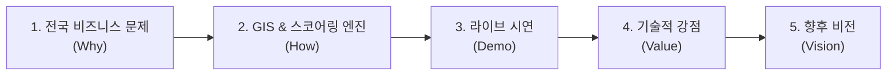

# 🏢 대한민국 맞춤형 회식장소 추천 서비스 (Nationwide Team Dinner Recommender)

> **"판교를 넘어 서울 6대 상권 및 전국 주요 광역시를 아우르는 데이터 기반 다차원 스코어링 회식 추천 플랫폼"**  
> 본 문서는 시스템 아키텍처, 전국 지리공간(GIS) 엔진, 다차원 스코어링 알고리즘 및 **프레젠테이션 발표 가이드**를 담고 있습니다.

---

## 📑 목차 (Table of Contents)
1. [프로젝트 개요 (Executive Summary)](#1-프로젝트-개요-executive-summary)
2. [전국 서비스 시스템 아키텍처 (Architecture)](#2-전국-서비스-시스템-아키텍처-architecture)
3. [핵심 기술 및 알고리즘 구현 상세](#3-핵심-기술-및-알고리즘-구현-상세)
4. [프레젠테이션(Presentation) 발표 가이드](#4-프레젠테이션presentation-발표-가이드)
5. [지원 권역 및 데이터셋 (Coverage)](#5-지원-권역-및-데이터셋-coverage)
6. [설치 및 실행 방법 (Quickstart)](#6-설치-및-실행-방법-quickstart)

---

## 1. 프로젝트 개요 (Executive Summary)

### 1.1 해결하고자 하는 문제 (Problem Statement)
* **전국 비즈니스 상권의 회식 탐색 비용:** 판교, 강남, 여의도, 마곡, 부산 센텀 등 주요 오피스 밀집 지역에서 예산, 인원수, 단독 룸, 지하철역 접근성, 휴무일을 모두 만족하는 장소를 찾는 데 많은 시간과 노력이 소모됨
* **거리 및 위치 편차:** 기준 위치(회사, 특정 지하철역)로부터의 실제 도보/이동 거리가 반영되지 않아 장소 선정 실패 발생
* **정량적 스코어링 부재:** 단순 리뷰 수나 평점 순 나열로 인해 실제 팀의 제약 조건(1인 예산 한도, 단체석 수용 인원)을 만족하지 못함

### 1.2 핵심 솔루션 (Key Solution)
* **전국 10대 핵심 비즈니스 허브 & 커스텀 지오코딩:** 전국 주요 오피스 권역 원클릭 선택 및 임의의 지하철역/지명 자유 검색 지원
* **하버사인(Haversine) 동적 거리 계산 엔진:** 선택된 기준점과 각 식당 간의 구면 거리를 실시간(m 단위)으로 계산하여 접근성 점수 산출
* **다차원 가중합 100점 스코어링:** 예산(35%), 룸/단체석(30%), 접근성(20%), 평점/리뷰(15%)를 실시간 정규화
* **인터랙티브 GIS 시각화 (`Pydeck`):** 선택한 권역으로 카메라 시점이 자동 이동하며, 핀 호버 시 위도/경도 좌표와 도로명 주소 툴팁 제공

---

## 2. 전국 서비스 시스템 아키텍처 (Architecture)

```
[ 1. Geospatial & Geocoding Layer ]
  ├─ 전국 10대 비즈니스 허브 (판교, 강남, 여의도, 을지로, 성수, 마곡, 가산, 송도, 부산, 대전)
  └─ 카카오 지오코더 (키워드/지하철역 ➔ 위도/경도 자동 추출)
       ▼
[ 2. Data & Ingestion Layer ]
  ├─ 전국 다권역 시드 데이터셋 (data/restaurants.csv)
  └─ 카카오 로컬 REST API 전국 반경 수집기 (collectors/kakao_collector.py)
       ▼
[ 3. Dynamic Distance & Scoring Engine ]
  ├─ Haversine 구면 거리 계산기 (pipeline/geo_utils.py)
  ├─ 결측치 방어형 타입 캐스팅 (safe_float, safe_int)
  └─ 다차원 정규화 가중합 스코어링 (pipeline/scoring.py)
       ▼
[ 4. Modern Dashboard & GIS UI Layer ]
  └─ app.py (Streamlit + Pydeck)
       ├─ GBSA 테마 스타일링 (Navy #0B4F9E / SkyBlue #2E86DE)
       ├─ 사이드바: 권역 선택, 자유 위치 검색, 반경 조절, 요일/예산/인원/가중치 필터
       ├─ 탭 1: 추천 순위 카드 뷰 (상세 정보 & 카카오맵 다이렉트 딥링크)
       ├─ 탭 2: Pydeck 인터랙티브 3D/2D 지도 (자동 뷰포트 이동 & 좌표 툴팁)
       └─ 탭 3: 전체 비교 데이터프레임
       ▼
[ 5. Production Cloud Deployment ]
  └─ GitHub (jay-jay-jay/pangyo-team-dinner-recommender) ➔ Streamlit Community Cloud
```

---

## 3. 핵심 기술 및 알고리즘 구현 상세

### 3.1 동적 구면 거리 계산 (Haversine Formula)
선택된 기준점 좌표 \((lat_1, lng_1)\)과 식당 좌표 \((lat_2, lng_2)\) 간의 실제 거리 \(d\)를 계산합니다:

\[
a = \sin^2\left(\frac{\Delta \text{lat}}{2}\right) + \cos(\text{lat}_1)\cos(\text{lat}_2)\sin^2\left(\frac{\Delta \text{lng}}{2}\right)
\]
\[
d = 2 \cdot R \cdot \arctan2\left(\sqrt{a}, \sqrt{1-a}\right) \quad (R = 6,371,000\text{m})
\]

### 3.2 4대 지표 정규화 스코어링 공식
\[
S_{\text{total}} = \frac{W_p S_p + W_r S_r + W_a S_a + W_s S_s}{\sum W} \times 100
\]

| 지표명 | 산출 공식 및 정규화 로직 | 기본 비중 |
|---|---|:---:|
| **가격 적합도 (\(S_p\))** | \(\max\left(0, 1 - \frac{|\text{식당가격} - \text{목표예산}|}{\text{목표예산}}\right)\) | 35% |
| **룸/단체석 적합도 (\(S_r\))** | 룸 보유 & 최대수용인원 \(\ge\) 인원: `1.0`, 한 가지 충족: `0.5`, 미충족: `0.1` | 30% |
| **동적 거리 접근성 (\(S_a\))** | \(\max\left(0, 1 - \min\left(\frac{d_{\text{haversine}}}{3000}, 1\right)\right)\) (3km 기준 감점) | 20% |
| **리뷰 및 평점 신뢰도 (\(S_s\))** | \(\left(\frac{\text{평점}}{5.0} \times 0.6\right) + \left(\min\left(\frac{\text{리뷰수}}{100}, 1\right) \times 0.4\right)\) | 15% |

---

## 4. 프레젠테이션(Presentation) 발표 가이드



### 🎙️ 발표 스크립트 가이드

* **Slide 1. 도입 (Why):**  
  *"판교에서 시작한 맞춤형 회식 추천 알고리즘을 강남, 여의도, 을지로, 마곡, 부산, 대전 등 **대한민국 전역의 핵심 비즈니스 권역**으로 확장했습니다. 직장인 누구나 회사 위치나 약속 장소에 맞춰 최적의 회식 장소를 3초 만에 찾을 수 있습니다."*

* **Slide 2. 기술 핵심 (How):**  
  *"지오코딩과 하버사인(Haversine) 공식을 결합하여 사용자가 입력한 어떤 위치든 기준점과의 실제 거리를 실시간 계산합니다. 예산, 인원수, 룸 보유 여부, 평점을 4대 축으로 종합 점수를 산출합니다."*

* **Slide 3. 라이브 시연 (Live Demo):**  
  1. 사이드바에서 `[강남]` 또는 `[부산]`을 선택하면 지도가 즉시 해당 도시로 이동하는 모습 시연
  2. 자유 검색창에 `삼성역` 또는 `해운대`를 입력하여 동적 반경 내 식당 추천 확인
  3. 가중치 슬라이더를 조작하여 실시간 1위 순위가 변동되는 모습 시연
  4. `🗺️ 카카오맵 상세` 버튼으로 즉시 길찾기/리뷰 페이지 연결

* **Slide 4. 기술적 차별점 (Value):**  
  * 결측치 방어형 데이터 파이프라인
  * `Pydeck`을 활용한 전국 다권역 GIS 3D/2D 렌더링
  * Streamlit Cloud를 통한 24시간 무중단 글로벌 웹 배포

* **Slide 5. 향후 로드맵 (Vision):**  
  * 공공데이터포털 안심식당 전국 DB 연동
  * LLM 기반 자연어 회식 테마 추천 및 리뷰 감성 분석 결합

---

## 5. 지원 권역 및 데이터셋 (Coverage)

| 권역 구분 | 대표 지역 및 특징 |
|---|---|
| **수도권 핵심 8대 권역** | 판교테크노밸리, 강남/역삼, 여의도 금융가, 을지로/광화문 CBD, 성수/뚝섬, 마곡 R&D, 가산 G밸리, 송도국제도시 |
| **전국 주요 광역시** | 부산 (서면 / 해운대 센텀시티), 대전 (둔산 정부청사 / 대덕R&D) |
| **자유 검색 모드** | 전국 모든 지하철역 및 주요 랜드마크 키워드 지오코딩 지원 |

---

## 6. 설치 및 실행 방법 (Quickstart)

```bash
# 1. 저장소 복제 (Clone)
git clone https://github.com/jay-jay-jay/pangyo-team-dinner-recommender.git
cd pangyo-team-dinner-recommender

# 2. 가상환경 생성 및 실행 (Windows PowerShell)
python -m venv venv
.\venv\Scripts\Activate.ps1

# 3. 의존성 설치
pip install -r requirements.txt

# 4. 앱 실행
streamlit run app.py
```

브라우저에서 `http://localhost:8501` 에 접속하여 확인합니다.
