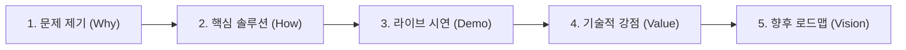

# 🍽️ 판교테크노밸리 맞춤형 회식장소 추천 서비스 (Pangyo Team Dinner Recommender)

> **"판교 직장인을 위한 데이터 기반 다차원 스코어링 회식 장소 추천 플랫폼"**  
> 본 문서는 프로젝트의 기술 아키텍처, 구현 세부 사항 및 **프레젠테이션(발표)용 구조화 가이드**를 포함하고 있습니다.

---

## 📑 목차 (Table of Contents)
1. [프로젝트 개요 (Executive Summary)](#1-프로젝트-개요-executive-summary)
2. [시스템 아키텍처 및 파이프라인 (Architecture)](#2-시스템-아키텍처-및-파이프라인-architecture)
3. [구현 계획(Implementation Plan) 기준 세부 구현 내역](#3-구현-계획implementation-plan-기준-세부-구현-내역)
4. [프레젠테이션(Presentation) 발표 가이드](#4-프레젠테이션presentation-발표-가이드)
5. [프로젝트 디렉터리 구조 (Directory Structure)](#5-프로젝트-디렉터리-구조-directory-structure)
6. [설치 및 실행 방법 (Quickstart)](#6-설치-및-실행-방법-quickstart)

---

## 1. 프로젝트 개요 (Executive Summary)

### 1.1 해결하고자 하는 문제 (Problem Statement)
* **회식 장소 선정의 피로도:** 인원수, 1인 예산, 메뉴 취향, 판교역 접근성, 단독 룸 보유 여부 등 수많은 변수를 일일이 블로그/포털 검색으로 맞추는 데 막대한 시간 소요
* **정보의 불확실성:** 단체 수용 인원 미확인, 특정 요일 휴무로 인한 당일 예약 취소 발생
* **주관적 추천의 한계:** 개인 취향에 치우친 검색으로 팀원 전체의 만족도 저하

### 1.2 핵심 솔루션 (Key Solution)
* **다차원 가중합 스코어링 엔진:** 사용자가 설정한 예산, 인원수, 접근성, 평점 가중치에 따라 실시간으로 적합도를 100점 만점으로 계산
* **실시간 인터랙티브 대시보드:** 요일별 휴무 자동 필터링, GBSA(경기도경제과학진흥원) 디자인 시스템이 적용된 반응형 카드 UI
* **지리공간(GIS) 시각화:** `Pydeck` 기반 인터랙티브 지도에 정확한 위도/경도 좌표 및 도로명 주소 툴팁 연동
* **다이렉트 카카오맵 연동:** 모바일/데스크톱에서 원클릭으로 카카오맵 상세 리뷰 및 길찾기 연결

---

## 2. 시스템 아키텍처 및 파이프라인 (Architecture)

```
[ Data Layer ]
  └─ 카카오 로컬 API / 시드 데이터셋 (data/restaurants.csv)
       │ (위도/경도, 도로명주소, 1인예산, 룸유무, 최대좌석, 휴무일, 평점/리뷰)
       ▼
[ Pipeline & Scoring Engine ]
  └─ pipeline/scoring.py
       ├─ 안전한 타입 캐스팅 (safe_float, safe_int)
       ├─ 4대 핵심 지표 정규화 (Price, Room, Access, Rating)
       └─ 동적 가중치 가중합 계산 (0 ~ 100점)
       ▼
[ Presentation & UI Layer ]
  └─ app.py (Streamlit)
       ├─ GBSA 브랜드 컬러 팔레트 (#0B4F9E Navy, #2E86DE SkyBlue)
       ├─ 사이드바: 날짜/메뉴/예산/인원/가중치 필터
       ├─ 탭 1: 맞춤 추천 순위 카드 뷰 (상세 스펙 & 카카오맵 연동)
       ├─ 탭 2: Pydeck 인터랙티브 3D/2D 위치 지도 (좌표/주소 툴팁)
       └─ 탭 3: 전체 비교 데이터 테이블
       ▼
[ Deployment Layer ]
  └─ GitHub (jay-jay-jay/pangyo-team-dinner-recommender) ➔ Streamlit Community Cloud
```

---

## 3. 구현 계획(Implementation Plan) 기준 세부 구현 내역

### Phase 1. 데이터 수집 및 정제 레이어 (`data/restaurants.csv`)
* **표준 데이터 스키마 구축:**
  * 식당 식별자(`restaurant_id`), 이름(`name`), 메뉴 대분류(`cuisine_type`), 상세 카테고리(`category`)
  * 지리공간 정보(`lat`, `lng`, `distance_m_from_hub`, `address_road`)
  * 회식 조건 정보(`price_per_person`, `has_private_room`, `group_seating_max`, `parking_available`)
  * 소셜 신뢰도(`rating`, `review_count`, `phone`, `closed_days`, `place_url`)
* **CSV 파싱 안정성 확보:** 쉼표가 포함된 카테고리/휴무일 텍스트에 대해 철저한 인용 부호 처리 및 인코딩(UTF-8) 표준화

### Phase 2. 다차원 스코어링 알고리즘 (`pipeline/scoring.py`)
각 식당의 적합도 점수 \(S\)는 사용자가 정의한 4대 축의 가중합으로 산출됩니다:

\[
S = \frac{W_{\text{price}} \cdot S_{\text{price}} + W_{\text{room}} \cdot S_{\text{room}} + W_{\text{access}} \cdot S_{\text{access}} + W_{\text{rating}} \cdot S_{\text{rating}}}{\sum W} \times 100
\]

| 평가 항목 | 산출 공식 및 정규화 로직 | 기본 가중치 |
|---|---|:---:|
| **1. 가격 적합도 (\(S_{\text{price}}\))** | \(\max\left(0, 1 - \frac{|\text{식당가격} - \text{목표예산}|}{\text{목표예산}}\right)\) | 35% |
| **2. 룸/단체석 적합도 (\(S_{\text{room}}\))** | 룸 보유 & 최대수용인원 \(\ge\) 회식인원: `1.0`<br>둘 중 하나 만족: `0.5`, 미충족: `0.1` | 30% |
| **3. 판교역 접근성 (\(S_{\text{access}}\))** | \(\max\left(0, 1 - \min\left(\frac{\text{거리(m)}}{3000}, 1\right)\right)\) (3km 이내 선형 감점) | 20% |
| **4. 리뷰 신뢰도 (\(S_{\text{rating}}\))** | \(\left(\frac{\text{평점}}{5.0} \times 0.6\right) + \left(\min\left(\frac{\text{리뷰수}}{100}, 1\right) \times 0.4\right)\) | 15% |

### Phase 3. 대시보드 UI & 지리공간 시각화 (`app.py`)
* **GBSA 테마 디자인 시스템:**
  * 공공/비즈니스 신뢰도를 전달하는 딥 네이비(`0B4F9E`)와 세련된 스카이블루(`2E86DE`) 배색
  * 상단 헤더 배너, 추천 순위 배지, 영업/휴무 상태 배지 적용
* **반응형 3단 탭 구성:**
  1. **추천 카드 뷰:** 1위~N위 순위별 핵심 정보(주소, 거리, 가격, 룸/좌석) 및 카카오맵 검색 딥링크 제공
  2. **Pydeck 인터랙티브 맵:** 판교역 기준 반경 내 식당 포인트를 시각화하고 호버(Hover) 시 식당명, 도로명 주소, 좌표, 평점 툴팁 제공
  3. **전체 데이터 표:** 전 식당의 수치를 한눈에 소팅·비교할 수 있는 데이터프레임 제공
* **요일별 동적 휴무 필터링:** 선택한 회식 일자의 요일(월~일)에 정기 휴무인 식당 자동 필터링

### Phase 4. 클라우드 배포 및 글로벌 접근성
* **Streamlit Community Cloud:** GitHub 저장소 연동을 통한 24시간 무중단 무료 호스팅
* **Localtunnel:** 개발 및 빠른 피드백을 위한 즉시 공유용 서브 터널 지원

---

## 4. 프레젠테이션(Presentation) 발표 가이드

> 💡 **Tip:** 다른 사람에게 프로젝트를 소개할 때는 **[1. 배경/문제] ➔ [2. 해결 알고리즘] ➔ [3. 라이브 데모] ➔ [4. 기술적 차별점] ➔ [5. 향후 계획]** 순서로 3~5분 내외로 발표하는 것이 가장 효과적입니다.



---

### 🎙️ 슬라이드별 발표 스크립트 & 핵심 포인트

#### Slide 1. 문제 제기 (Why?)
* **발표 멘트:**  
  *"판교테크노밸리에서 회식 장소를 잡을 때 매번 예산, 인원수, 룸 유무, 판교역과의 거리를 수작업으로 대조하느라 많은 시간이 낭비됩니다. 저희는 이 문제를 **데이터 기반 다차원 스코어링 알고리즘**으로 해결하고자 본 프로젝트를 시작했습니다."*
* **강조 키워드:** 회식 탐색 비용 절감, 조건 불일치 방지, 데이터 기반 의사결정

#### Slide 2. 핵심 알고리즘 & 아키텍처 (How?)
* **발표 멘트:**  
  *"단순히 평점 순으로 나열하는 것이 아니라, 사용자가 지정한 **1인 목표 예산, 회식 인원수, 판교역 접근성, 평점/리뷰 신뢰도**의 4가지 축을 정규화하여 가중합 점수(100점 만점)를 실시간으로 계산합니다. 사용자는 슬라이더를 통해 각 조건의 우선순위를 즉시 커스텀할 수 있습니다."*
* **강조 키워드:** 실시간 정규화 공식, 동적 가중치 조절, 요일별 자동 휴무 판별

#### Slide 3. 라이브 데모 시연 (Live Demo Workflow)
* **데모 순서:**
  1. **조건 설정:** 사이드바에서 회식 날짜(예: 금요일), 메뉴(예: 한식), 1인 예산 40,000원, 인원 8명 설정
  2. **가중치 커스텀:** '룸/단체석 확보' 비중을 높여 순위가 즉각적으로 재정렬되는 모습 시연
  3. **추천 카드 확인:** 1위 추천 장소의 룸 유무, 판교역 거리(m), 1인 예상 가격 확인
  4. **지도 시각화 탭:** `🗺️ 위치 지도 보기` 탭으로 전환하여 핀 호버 툴팁(좌표/도로명 주소) 확인
  5. **원클릭 카카오맵 연동:** `🗺️ 카카오맵 상세` 버튼 클릭으로 실제 카카오맵 상세 페이지 연동 시연

#### Slide 4. 기술적 차별점 및 엔지니어링 성과 (Technical Value)
* **발표 멘트:**  
  *"안정적인 서비스 제공을 위해 결측치 및 타입 불일치를 완벽히 방어하는 `safe_cast` 파이프라인을 구축했으며, `Pydeck` 기반 지리공간 렌더링으로 높은 시각적 완성도를 달성했습니다. 또한 GitHub 기반 CI/CD와 Streamlit Cloud를 통해 누구나 모바일/PC에서 즉시 접속 가능한 프로덕션 환경을 구축했습니다."*
* **강조 키워드:** 방어적 데이터 엔지니어링, GIS 툴팁 시각화, 클라우드 무중단 배포

#### Slide 5. 향후 발전 방향 (Future Roadmap)
* **발표 멘트:**  
  *"향후에는 생성형 AI(LLM)를 결합하여 '조용하고 대화하기 좋은 분위기'와 같은 자연어 검색을 지원하고, 네이버/카카오 리뷰의 감성 분석(Sentiment Analysis)을 추천 점수에 추가 반영할 계획입니다."*

---

## 5. 프로젝트 디렉터리 구조 (Directory Structure)

```
pangyo-team-dinner-recommender/
├── app.py                      # Streamlit 웹 대시보드 메인 애플리케이션
├── streamlit_app.py            # Streamlit Cloud 호환용 진입점
├── data/
│   ├── restaurants.csv         # 판교 일대 15개 시드 맛집 정제 데이터셋
│   └── .gitkeep
├── pipeline/
│   ├── __init__.py
│   ├── scoring.py              # 다차원 가중합 스코어링 모듈 (safe type casting)
│   └── merge_clean.py          # 데이터 파이프라인 유틸리티
├── collectors/
│   └── kakao_collector.py      # 카카오 로컬 REST API 수집기
├── docs/
│   └── PLAN.md                 # 프로젝트 마스터 기획 및 설계 문서
├── requirements.txt            # 파이썬 의존성 패키지 목록
├── .gitignore
└── README.md                   # 프로젝트 문서 및 프레젠테이션 가이드
```

---

## 6. 설치 및 실행 방법 (Quickstart)

### 로컬 환경 실행
```bash
# 1. 저장소 복제 (Clone)
git clone https://github.com/jay-jay-jay/pangyo-team-dinner-recommender.git
cd pangyo-team-dinner-recommender

# 2. 가상환경 생성 및 활성화 (Windows PowerShell)
python -m venv venv
.\venv\Scripts\Activate.ps1

# 3. 필수 패키지 설치
pip install -r requirements.txt

# 4. Streamlit 애플리케이션 실행
streamlit run app.py
```
브라우저에서 `http://localhost:8501` 에 접속하여 확인합니다.

---

## 🌐 라이브 데모 링크
* **Streamlit Cloud:** [https://jay-jay-jay-pangyo-team-dinner-recommender.streamlit.app](https://github.com/jay-jay-jay/pangyo-team-dinner-recommender)
